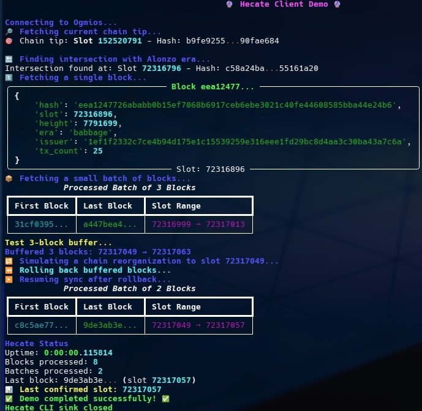

# Hecate 🔮 

[](https://github.com/ExuraLabs/hecate/actions/workflows/auto-pr-epoch-updates.yml)
[](https://www.python.org/downloads/release/python-3120/)
[](https://github.com/astral-sh/uv)
[](https://github.com/astral-sh/ruff)
[](http://mypy-lang.org/)
[](https://github.com/pre-commit/pre-commit)
[](https://spdx.org/licenses/GPL-3.0-or-later.html)

> The magical gateway between Ogmios and Exura for Cardano blockchain synchronization

## Overview


Hecate is an independent data relay service that connects through Ogmios and efficiently fetches both historical and real-time on-chain data.<br>
Named after the Greek goddess of magic, crossroads, and keeper of keys, Hecate serves as a bridge between the chain and downstream processing systems via standardized interfaces, focusing exclusively on reliable data acquisition and transmission through well-defined API boundaries, enabling integration with any system that needs to track on-chain data.
While its main use case is to forward data via Redis, it can also be configured to output to the command line interface (CLI) for debugging or testing purposes.

### NOTE: This project is in early development and is not yet ready for production use. Please use at your own risk.

## Architecture Overview

```
┌───────────────────────────────────────────────────────────────────────────────┐
│                                   HECATE                                      │
│                                                                               │
│  ┌─────────────┐     ┌────────────────────────────┐     ┌──────────────────┐  │
│  │             │     │                            │     │                  │  │
│  │   Async     │     │  Core Processing           │     │  Data Sinks      │  │
│  │   Client    │◄───►│                            │◄───►│                  │  │
│  │             │     │  ┌──────────┐ ┌─────────┐  │     │ ┌────────┐       │  │
│  └─────────────┘     │  │Historical│ │Realtime │  │     │ │Redis   │       │  │
│         ▲            │  │Sync Flow │ │Sync Flow│  │     │ │Sink    │       │  │
│         │            │  └──────────┘ └─────────┘  │     │ └────────┘       │  │
│         │            │                            │     │ ┌────────┐       │  │
│         │            │  ┌─────────────────┐       │     │ │CLI     │       │  │
│         │            │  │Periodic         │       │     │ │Sink    │       │  │
│         │            │  │Flows            │       │     │ └────────┘       │  │
│         │            │  └─────────────────┘       │     │                  │  │
│         │            │                            │     │                  │  │
│         │            └────────────────────────────┘     └──────────────────┘  │
│         │                        │                             │              │
└─────────┼────────────────────────┼─────────────────────────────┼──────────────┘
          │                        │                             │
          ▼                        │                             ▼
┌────────────────┐                 │                   ┌──────────────────────┐
│                │                 │                   │                      │
│    Cardano     │                 │                   │    Downstream        │
│    Node +      │                 │                   │    Applications      │
│    Ogmios      │                 │                   │    (e.g. Exura)      │
└────────────────┘                 ▼                   └──────────────────────┘
                           ┌────────────────┐
                           │                │
                           │    Prefect     │
                           │                │
                           └────────────────┘
```

Hecate consists of:

1. **Ogmios Client** - Asynchronous client for the Ogmios WebSocket API
2. **Data Relay** - Efficiently forward blockchain data with minimal transformation
3. **Prefect Flows** - Orchestrate historical and real-time data fetching
4. **Redis Integration** - Buffer transactions or send them as they come

## Features

- ⚡ **Parallel Historical Fetching** - Efficiently fetch the entire blockchain history in batches
- 🔄 **Real-time Data Relay** - Stay current with the latest blocks and relay them to Redis or CLI
- 🛡️ **Reorg Detection** - Catch chain reorganizations early and handle them gracefully
- 📊 **Advanced Monitoring** - Track connection status, latency, and throughput metrics via Prefect
- 🧰 **Flexible Deployment** - Run as a standalone service with simple configuration
- 🔌 **Optional Dependencies** - Use only what you need - Redis is optional and can be installed separately

### Demo
Hecate includes a demo script showcasing of some of the async client capabilities:
```bash
# Run the demo (assumes Ogmios on localhost)
uv run python -m demo
```



## Installation

### Prerequisites

- Python 3.12+
- uv (Python package manager)
- Redis (Optional)
- Ogmios node access

### Setup

```bash
# Clone the repository
git clone https://github.com/ExuraLabs/hecate.git
cd hecate

# Install dependencies
uv venv -p 3.12

# Install one of the following:
# 1) Base installation (no Redis support)
uv sync

# 2) With development tools
uv sync --group dev

# 3) Complete installation (all features)
uv sync --all-groups

# Optional - Set up pre-commit hooks
uv run pre-commit install
```

## Project Structure

```
hecate/
├── client/           # Ogmios WebSocket client
├── data/             # Constant historical data
├── flows/            # Prefect flow definitions
│   ├── historical    # Historical synchronization flows
│   ├── periodic      # Periodic flows for data updates
│   └── realtime      # Real-time synchronization flows
├── sinks/            # Data sinks
│   ├── redis/        # Redis sink for downstream service(s)
│   └── cli/          # CLI sink for command line output
├── constants         # Constant values and configurations
└── models            # Data models and type definitions
```

## Development


### Type Checking and Linting

```bash
# Run mypy for type checking
uv run mypy

# Run ruff for linting
uv run ruff check

# Run ruff for formatting
uv run ruff format
```


## License

This project builds on the [ogmios-python](https://gitlab.com/viperscience/ogmios-python) client, which is distributed under [GPL-3.0-or-later](https://spdx.org/licenses/GPL-3.0-or-later.html). As a result, this project is also shares the same license terms - see the LICENSE file for details.

## Acknowledgements

- [Ogmios](https://github.com/CardanoSolutions/ogmios) - WebSocket bridge that wraps Ouroboros' mini-protocols
- [ogmios-python](https://gitlab.com/viperscience/ogmios-python) - Original Python SDK for Ogmios
- [Koios](https://koios.rest/) - Distributed and open-source Cardano API
- [AdaStat](https://adastat.net/) - Advanced Cardano blockchain explorer and query layer
