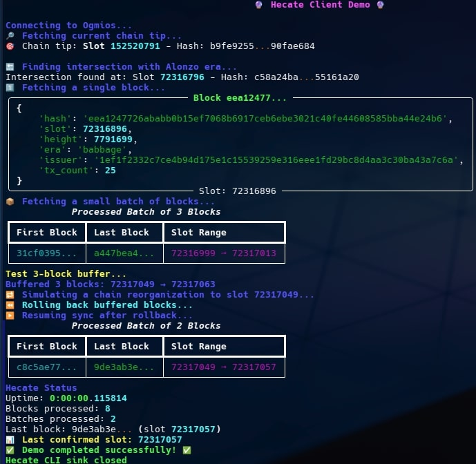

# Hecate 🔮 

[](https://www.python.org/downloads/release/python-3120/)
[](https://github.com/astral-sh/uv)
[](https://github.com/astral-sh/ruff)
[](http://mypy-lang.org/)
[](https://github.com/pre-commit/pre-commit)
[](https://spdx.org/licenses/GPL-3.0-or-later.html)

> The magical gateway between Ogmios and Exura for Cardano blockchain synchronization

## Overview


Hecate is an independent data relay service that connects through Ogmios and efficiently fetches both historical and real-time on-chain data.<br>
Named after the Greek goddess of magic, crossroads, and keeper of keys, Hecate serves as a bridge between the chain and downstream processing systems via standardized interfaces, focusing exclusively on reliable data acquisition and transmission through well-defined API boundaries, enabling integration with any system that needs to track on-chain data.
While its main use case is to forward data via Redis, it can also be configured to output to the command line interface (CLI) for debugging or testing purposes.

### NOTE: This project is in early development and is not yet ready for production use. Please use at your own risk.

## Architecture Overview

```
┌───────────────────────────────────────────────────────────────────────────────┐
│                                   HECATE                                      │
│                                                                               │
│  ┌─────────────┐     ┌────────────────────────────┐     ┌──────────────────┐  │
│  │             │     │                            │     │                  │  │
│  │   Async     │     │  Core Processing           │     │  Data Sinks      │  │
│  │   Client    │◄───►│                            │◄───►│                  │  │
│  │             │     │  ┌──────────┐ ┌─────────┐  │     │ ┌────────┐       │  │
│  └─────────────┘     │  │ Backfill │ │ Relay   │  │     │ │Redis   │       │  │
│         ▲            │  │(historic)│ │(planned)│  │     │ │Sink    │       │  │
│         │            │  └──────────┘ └─────────┘  │     │ └────────┘       │  │
│         │            │                            │     │ ┌────────┐       │  │
│         │            │             ▲              │     │ │CLI     │       │  │
│         │            │             │              │     │ │Sink    │       │  │
│         │            │        ┌────┴────┐         │     │ └────────┘       │  │
│         │            │        │   CLI   │         │     │                  │  │
│         │            └────────┴─────────┴─────────┘     └──────────────────┘  │
│         │                                                      │              │
└─────────┼──────────────────────────────────────────────────────┼──────────────┘
          │                                                      │
          ▼                                                      ▼
┌────────────────┐                                    ┌──────────────────────┐
│                │                                    │                      │
│    Cardano     │                                    │    Downstream        │
│    Node +      │                                    │    Applications      │
│    Ogmios      │                                    │    (e.g. Exura)      │
└────────────────┘                                    └──────────────────────┘
```

Hecate consists of:

1. **Ogmios Client** - Asynchronous client for the Ogmios WebSocket API
2. **Data Relay** - Efficiently forward blockchain data with minimal transformation
3. **Backfill Core** - A plain `asyncio` coroutine that fetches epochs concurrently, driven by a thin CLI
4. **Redis Integration** - Stream block data to downstream consumers via per-epoch Redis streams

## Features

- ⚡ **Parallel Historical Fetching** - Efficiently fetch the entire blockchain history in batches
- 🔄 **Real-time Data Relay** - Stay current with the latest blocks and relay them to Redis or CLI
- 🛡️ **Reorg Detection** - Catch chain reorganizations early and handle them gracefully
- 🪶 **No Orchestrator** - Just `asyncio` and a CLI; progress lives in the sink, not an engine's database
- 🔁 **Resumable** - Rerun after a failure and it continues from the last completed epoch
- 🧰 **Flexible Deployment** - Run as a standalone service with simple configuration
- 🔌 **Optional Dependencies** - Use only what you need - Redis is optional and can be installed separately

### Demo
Hecate includes a demo script showcasing of some of the async client capabilities:
```bash
# Run the demo (assumes Ogmios on localhost)
uv run python -m demo
```


## Usage 🔮

```bash
# Backfill from the first Shelley epoch to the chain's last finalized epoch
uv run python -m cli backfill

# A bounded range, six epochs at a time
uv run python -m cli backfill --start-epoch 208 --end-epoch 320 --concurrency 6

# No Redis needed — print what would be relayed
uv run python -m cli backfill --start-epoch 208 --end-epoch 208 --sink cli

# How far along is the Redis sink?
uv run python -m cli status
```

Epochs are fetched concurrently — each in its own process, since block parsing
is GIL-bound — then committed in ascending order so a consumer reading
epoch-by-epoch never sees a gap. Progress lives in the sink, so a rerun
resumes after the last epoch that completed, and a run whose window would leave
a gap in what consumers can read is
[refused rather than published](docs/backfill.md#bounded-windows-and-the-ordering-base).

`backfill()` is also usable directly as a library: give it something that
implements `send_batch` and it will relay blocks into it, no Redis and no CLI
involved. **[See the detailed backfill documentation](docs/backfill.md)**.

A `relay` command that follows the chain tip live is planned; the realtime
client machinery it will build on (`client/chainsync`, `sinks.base.BufferedSink`)
already exists.

Epoch boundaries and block counts are derived directly from the chain over the
same Ogmios connection used for streaming (see `epoch_derivation.py`), with an
optional [kupo](https://github.com/CardanoSolutions/kupo) endpoint to accelerate
boundary lookups. The committed `data/*.csv` are only a frozen bootstrap anchor
index; epochs past it are derived on demand and cached locally.

## Installation

### Prerequisites

- Python 3.12+
- uv (Python package manager)
- Redis (Optional)
- Ogmios node access

### Setup

```bash
# Clone the repository
git clone https://github.com/ExuraLabs/hecate.git
cd hecate

# Install dependencies
uv venv -p 3.12

# Install one of the following:
# 1) Base installation (CLI sink only, no Redis support)
uv sync

# 2) With the Redis sink
uv sync --group redis

# 3) Complete installation (Redis + development tools)
uv sync --all-groups
```

### Configuration

Settings are read from the environment at import time, optionally seeded from a
dotenv file — `.env` at the repo root by default, or point `HECATE_ENV_FILE` at
whichever one this environment should use. See the
[backfill docs](docs/backfill.md#execution) for the full table; the two that
matter most are `OGMIOS_ENDPOINTS` and `REDIS_URL`:

```bash
OGMIOS_ENDPOINTS='["ws://your-ogmios-host:1337"]' REDIS_URL='redis://localhost:6379/0' \
  uv run python -m cli backfill --end-epoch 210
```

## Project Structure

```
hecate/
├── cli               # Command line entry point (python -m cli)
├── backfill          # Historical backfill core — plain asyncio, no orchestrator
├── client/           # Ogmios WebSocket client
├── config/           # Environment-backed settings and logging setup
├── data/             # Frozen bootstrap epoch-boundary data
├── docs/             # Longer-form documentation
├── epoch_derivation  # Derive epoch boundaries from the chain
├── sinks/            # Data sinks
│   ├── base          # Sink protocols: BlockRelay, EpochCoordinator
│   ├── redis         # Redis sink for downstream service(s)
│   └── cli           # CLI sink for command line output
├── constants         # Constant values and configurations
└── models            # Data models and type definitions
```

## Development


### Type Checking and Linting

```bash
# Run mypy for type checking
uv run mypy

# Run ruff for linting
uv run ruff check

# Run ruff for formatting
uv run ruff format

# Set up pre-commit hooks
uv run pre-commit install
```


## License

This project builds on the [ogmios-python](https://gitlab.com/viperscience/ogmios-python) client, which is distributed under [GPL-3.0-or-later](https://spdx.org/licenses/GPL-3.0-or-later.html). As a result, this project is also shares the same license terms - see the LICENSE file for details.

## Acknowledgements

- [Ogmios](https://github.com/CardanoSolutions/ogmios) - WebSocket bridge that wraps Ouroboros' mini-protocols
- [ogmios-python](https://gitlab.com/viperscience/ogmios-python) - Original Python SDK for Ogmios
- [kupo](https://github.com/CardanoSolutions/kupo) - Fast, lightweight chain-index used to accelerate epoch-boundary lookups
